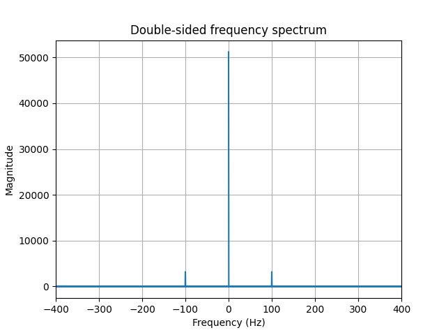
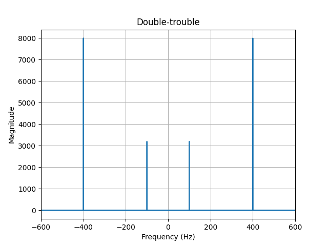
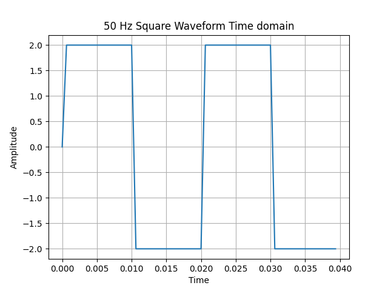
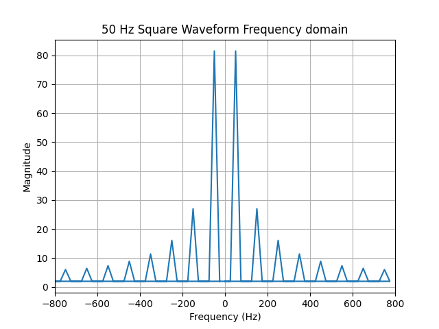

# Frequency spectrum
Now we will analyse discrete-time signals in the frequency domain. The Fourier transform will transform our time-domain signal into the frequency-domain. An efficient implementation of this Fourier transform is called the Fast Fourier Transform (FFT)

## 2.1 Ignition
Show the double-sided frequency spectrum of the sampled sine function (Question 1.2). Pay special attention to the horizontal axis, which should have the unit of frequency. Explain what you see. Tip: The MATLAB documentation is very helpful type ‘doc fft’ in the MATLAB prompt.

### 2.1 Answer
1) Signal definition
````python
T = 1 / 1600
x = np.arange(0, 2, T)
y = 4 + 2 * np.sin(2 * np.pi * 100 * x)
````
2) FFT compute the Fast Fourier Transform of the signal to transform the signal from the time domain to the frequency domain 
````python
yf = np.fft.fft(y)
````
3) Frequency bins first calculating the number of samples in the signal and then generate the frequency bins for the FFT output 
````python
N = len(y)
xf = np.fft.fftfreq(N, T)
````
4) Power spectrum calculate the power spectrum of the signal
````python
magnitude_spectrum = np.abs(yf)
````
5) Plot the signal



The graph shows a peak at 0 Hz, -100 Hz and 100 Hz. The peak at 0 Hz represents the presence of a DC component. The constant term '4' contributes to this DC component resulting in a peak at 0 Hz. The peak at -100 Hz and 100 Hz correspond to the sinusoidal component of the signal. 


## 2.2 Double trouble
First, sketch the spectrum of the signal given below. After this use MATLAB/Python to show the doublesided frequency spectrum of the following signal, remember the sampling frequency is still 1600Hz

### 2.2 Answer
1) Signal definition
````python
T = 1 / 1600
x = np.arange(0, 2, T)
y = 2 * np.sin(2 * np.pi * 100 * x) + 5 * np.cos(2 * np.pi * 1200 * x)
````
2) FFT compute the Fast Fourier Transform of the signal to transform the signal from the time domain to the frequency domain 
````python
yf = np.fft.fft(y)
````
3) Frequency bins first calculating the number of samples in the signal and then generate the frequency bins for the FFT output 
````python
N = len(y)
xf = np.fft.fftfreq(N, T)
````
4) Power spectrum calculate the power spectrum of the signal
````python
magnitude_spectrum = np.abs(yf)
````
5) Plot the signal


The function has two components the sine and cos component. First looking at the sine component, the wave has a frequency of 100 Hz. This means that there will be a peak in the graph at 100 and -100 Hz. For the cos component the frequency is 1200 Hz. The sampling frequency is 1600 so 1600 - 1200 = 400 Hz. So the graph will have a peak on 
400 and -400 Hz. 

## 2.3 Square wave 
Consider a 50Hz square wave (-2V, +2V). For this signal:

- Plot the time-domain signal
- Plot the single-sided frequency spectrum of this signal

Motivate your choice for the sampling frequency and describe what you observe in the frequency domain.

### 2.3 Answer
1) Signal definition
````python
T = 1 / 1600
x = np.arange(0, 0.04, T)
y = 2 * np.sign(np.sin(2 * np.pi * 50 * x))
````
The frequency of the signal is 50 Hz so a period is 1/50 seconds (0.02 seconds) so a time period of 0.04 seconds shows exactly two periods of the signal.

The frequency of n highest harmonic can be calculated with fn = n * 50 and the result of that calculation then should be multiplied with two because of nyquist. But because of aliasing it is better to take a high frequency.  

2) Plot time domain

3) FFT compute the Fast Fourier Transform of the signal to transform the signal from the time domain to the frequency domain 
````python
yf = np.fft.fft(y)
````
4) Frequency bins first calculating the number of samples in the signal and then generate the frequency bins for the FFT output 
````python
N = len(y)
xf = np.fft.fftfreq(N, T)
````
5) Power spectrum calculate the power spectrum of the signal
````python
magnitude_spectrum = np.abs(yf)
````
6) Plot frequency spectrum
