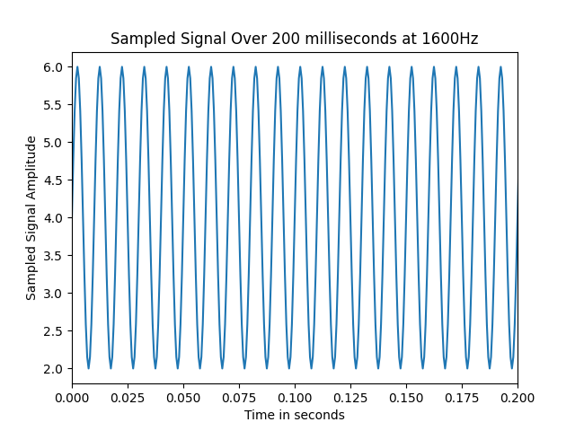

# 1 Sampling
## 1.1 Sampled time 
Generate an array representing the sampled time
````
𝑡[𝑛] = {0, 𝑇, 2𝑇, 3𝑇, 4𝑇, … (𝑛 − 1)𝑇}
````
Where 𝑇 is the sampling period. The array should represent the time between 0 and 2 seconds sampled at 1600Hz. What is the maximum frequency which can be present in a continuous signal such that the original signal can be reconstructed again from the sampled signal?

### 1.1 Answer
To generate an array that is representing the sampled time the **NumPy** library can be used. This library provides a function _np.arange()_. The function takes three parameters:
- **Start:** the start of the interval, the interval will include this value.
- **stop**: the end of the interval, the interval will not include this value. 
- **step**: the spacing between the values.

First calculating the sampling period with the formula T=1/fs and then adding the parameters to the _np.arange()_. 
````python
# Sampling frequency
fs = 1600
# Calculating the sampling period
T = 1 / fs
# Over a period of two seconds (start 0, end 2, sampling rate is 1/1600Hz)
sampling_period = np.arange(0, 2, T)
````
The maximum frequency which can be present in a continuous signal such that the original signal can be reconstructed again from the sampled signal is half the sampling rate. This is according to the Nyquist sampling theorem.
```math
f_{max} < f_s/2
```
This means that in this case the maximum frequency is 800 Hz. 

## 1.2 Sampled signal
Use the sampled time signal from the previous assignment to create a sampled version of the following function:
```math
x = 4+2*np.sin(2*\pi*100*t)
```
### 1.2 Answer
```python
sampled_signal = 4+2*np.sin(2*np.pi*100*sampling_period)
```
## 1.3 Plot the sampled signal - question
Display the previous sampled signal as a function of time. Make sure your axis are labelled properly. Choose the axis range such that the period of the signal is clear.

### 1.3 Answer
To plot the signal as a function of time the library matplotlib is used. 
This library provides functions to plot data into a graph. 
To plot the sampled signal first the sampling period and the sampling rate are defined. The formula for calculating the sampling period is:  
```math
T=1/fs
```
To change the axis range the _plt.xlim_
can be used. 
```python
plt.plot(sampling_period, sampled_signal)
plt.xlabel('Time in seconds')
plt.ylabel('Sampled Signal Amplitude')
plt.title('Sampled Signal Over 200 milliseconds at 1600Hz')
plt.xlim(0, 0.2)
plt.show()
```

