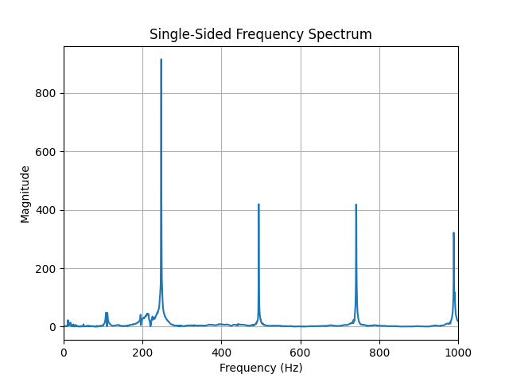

# Frequency analysis
We can already apply our knowledge of DSP to create a guitar tuning program. Read in the audio file and determine which open guitar string is being struck. The sampling frequency of the audio signal is 44100 Hz.

1. Plot the single-sided frequency spectrum from 0 Hz till 1 kHz.
2. Determine the frequency of the guitar string. Which string is it ?

Useful MATLAB commands: audioread(), fft(), xlim()

## Answer
1) Read the audio file
```python
sample_rate, audio_data = wavfile.read("week2_unknown_guitar_string.wav")
```
The read function returns the sampling rate of the audio file and the audio data itself. 
2) Get the sampling period
```python
T = 1 / sample_rate
```
3) FFT compute the Fast Fourier Transform of the signal to transform the signal from the time domain to the frequency domain 
````python
yf = np.fft.fft(audio_data)
````
4) Frequency bins first calculating the number of samples in the signal and then generate the frequency bins for the FFT output 
````python
N = len(audio_data)
    xf = np.fft.fftfreq(N, T)[:N//2]
````
The [:N//2] selects the first half of the frequency bins corresponding to the positive frequencies. 
5) Power spectrum calculate the power spectrum of the signal
````python
magnitude_spectrum = 2.0/N * np.abs(yf[:N//2])
````
Calculate the magnitude for the first half of the spectrum. 
6) Plot the signal

7) Get the peak frequency
````python
peak_freq = xf[np.argmax(magnitude_spectrum)]
print(peak_freq)
````
The output is '247.5 Hz' this means that the note is B3 so the B string got struck. 