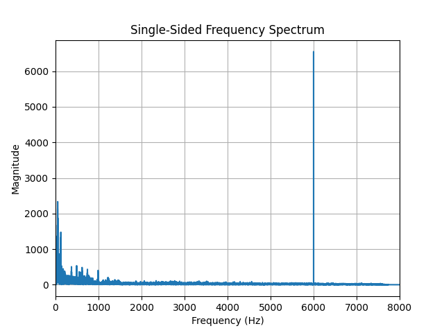

# Audio filtering
A short audio sample has been provided with an interference. The sampling rate is 16kHz.
## Signal analysis
First step is to analyse the signal, this way we can find out which frequency has to be filtered out.
1. Plot the single-sided frequency spectrum of the audio sample.
2. Determine the frequency of the interference signal.

### Answer
1) Read the audio file
```python
sample_rate, audio_data = wavfile.read("week3_sample_dist.wav")
```
The read function returns the sampling rate of the audio file and the audio data itself. 
2) Get the sampling period
```python
T = 1 / sample_rate
```
3) FFT compute the Fast Fourier Transform of the signal to transform the signal from the time domain to the frequency domain 
````python
yf = np.fft.fft(audio_data)
````
4) Frequency bins first calculating the number of samples in the signal and then generate the frequency bins for the FFT output 
````python
N = len(audio_data)
    xf = np.fft.fftfreq(N, T)[:N//2]
````
The [:N//2] selects the first half of the frequency bins corresponding to the positive frequencies. 
5) Power spectrum calculate the power spectrum of the signal
````python
magnitude_spectrum = 2.0/N * np.abs(yf[:N//2])
````
Calculate the magnitude for the first half of the spectrum. 
6) Plot the signal

7) Get the peak frequency
````python
peak_freq = xf[np.argmax(magnitude_spectrum)]
print(peak_freq)
````
The output is '6000.0 Hz' this is the frequency of the interference signal. 

## Low pass filter design
As we have seen in the lectures the transfer function in the Laplace domain for a simple low pass filter is
````
𝐻𝑙(𝑠) = 1 / (1 + s*tau)
````
Determine the digital equivalent of this filter using the Zero-order Hold (ZoH) approximation technique. As cut-off frequency we will use ½ the interference frequency
````
fc = 1/2 f_interference
````
1. Determine 𝐻(𝑧)
2. Determine the difference equation

### Answer
```
Hz = (1/exp(-1/tau)) / (z-exp(-T/tau))
```
